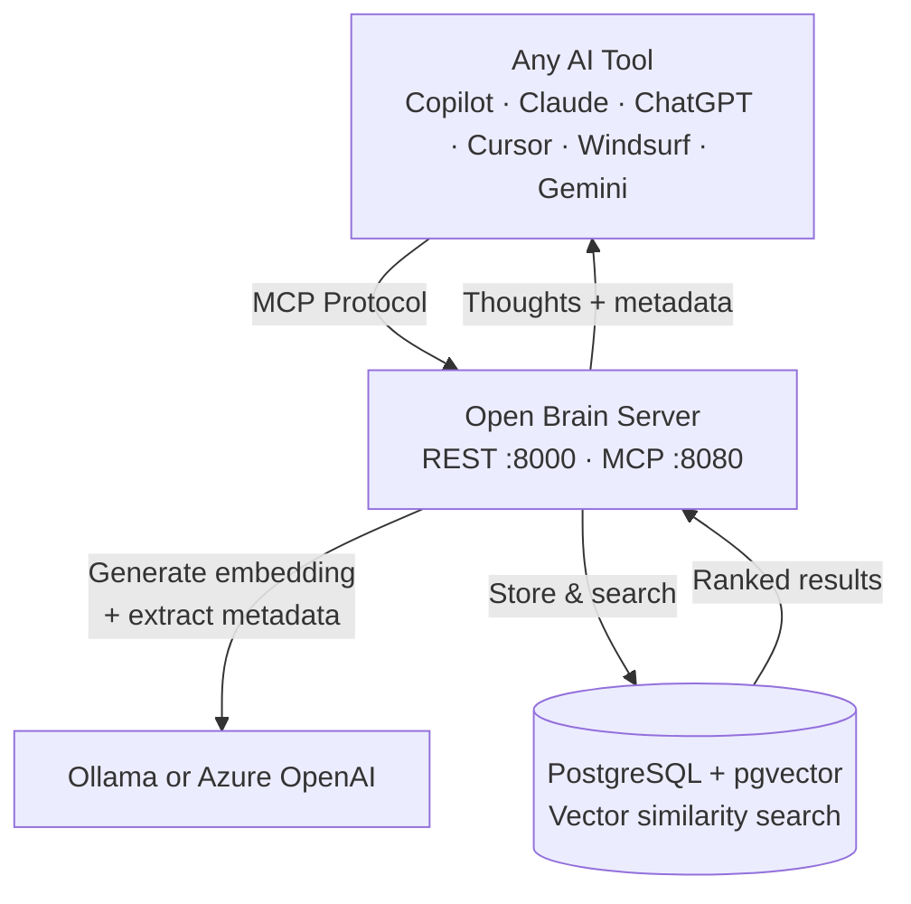
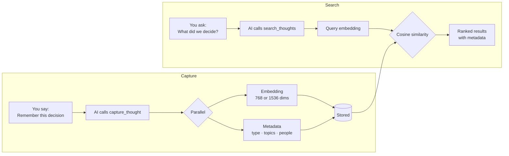

# Open Brain

[](https://github.com/srnichols/OpenBrain/actions/workflows/ci.yml)
[](LICENSE)
[](https://nodejs.org/)
[](https://www.typescriptlang.org/)
[](https://modelcontextprotocol.io/)
[](https://srnichols.github.io/OpenBrain/)

**Persistent, searchable memory for every AI tool you use — solo or as a small team.**

> 📖 **[Read the full documentation →](https://srnichols.github.io/OpenBrain/)**

### The Problem

Every AI conversation starts from zero. You explained your architecture to Claude last week, made a caching decision in ChatGPT yesterday, captured a pattern in GitHub Copilot this morning, and now Cursor has no idea about any of it. Your knowledge is scattered across platforms, locked inside sessions that expire.

### The Solution

Open Brain is a shared memory backend that any MCP-compatible AI tool can read from and write to. Capture a thought from GitHub Copilot, search for it from Claude, review it from ChatGPT — all hitting the same database of your decisions, patterns, and context.

```
You: "Remember that we chose Redis for session caching."
     → GitHub Copilot calls capture_thought → stored with embedding + auto-extracted metadata

Later, from any tool:
You: "What did we decide about caching?"
     → Claude calls search_thoughts → finds it by meaning, not keywords
     → "Decision: Redis for session caching. Reason: ..."
```

### Why Set It Up?

- **Your AI gets smarter over time** — every captured thought compounds into a richer knowledge base
- **Switch AI tools freely** — your context travels with you, not locked to one vendor
- **Small teams (1-3 devs) share context** — tag thoughts with `created_by` so the whole team's decisions are searchable, filterable by person
- **Decisions survive** — months later, ask "why did we choose PostgreSQL over MongoDB?" and get the exact reasoning
- **Works with what you already use** — GitHub Copilot, VS Code, Claude, ChatGPT, Gemini, Cursor, Windsurf, and any MCP client

### Works Great With Plan Forge

If you use [Plan Forge](https://github.com/srnichols/plan-forge) for agentic project execution, Open Brain is the memory layer. Plan Forge's agents can capture architecture decisions, patterns, and postmortems during execution, then retrieve that context in future projects. See [Plan Forge's Unified System Architecture](https://github.com/srnichols/plan-forge/blob/master/docs/UNIFIED-SYSTEM-ARCHITECTURE.md) for how the two systems integrate.

> Based on [Nate B Jones'](https://www.natebjones.com) Open Brain architecture. This is a **significantly extended** self-hosted implementation — see [Differences from Nate's Original](#differences-from-nates-original) below.

---

## How It Works



You capture a thought from **any AI client**. Open Brain generates a vector embedding, extracts metadata (type, topics, people mentioned), and stores it. Later, **any AI client** can semantically search your memories by meaning, not keywords.



---

## Features

- **Semantic Search** — Find thoughts by *meaning*, not keywords. Ask "what did we decide about caching?" and get results even if you never used the word "caching" in the original thought.
- **Auto-Metadata Extraction** — Every thought is automatically classified: type (decision, pattern, bug, etc.), topics, people mentioned, action items, dates. No manual tagging.
- **Provenance Helpers** — Generated columns and partial indexes for exact-source deduplication via `match_thoughts_by_source` RPC, plus a `GET /memories/by-source` REST endpoint.
- **9 AI Clients Supported** — VS Code Copilot, Claude Code, Claude Desktop, Cursor, Windsurf, ChatGPT, Gemini, Grok, and any MCP-compatible client.
- **REST API** — Direct HTTP access for scripts, webhooks, CI/CD integrations, and non-MCP tools. Every MCP tool has a REST equivalent.
- **Multi-Developer Teams** — Optional `created_by` field lets 1-3 devs share one instance with per-user filtering.
- **Project Scoping** — Isolate thoughts per project. Search within "ecommerce-api" without noise from "internal-tools".
- **4 Deployment Options** — Docker Compose (free, 5 min), Azure (managed, ~$15/mo), Kubernetes (homelab), or Supabase (cloud).
- **Self-Hosted & Private** — Your data stays on your infrastructure. No vendor lock-in.
- **27-Test Integration Suite** — Run `npm run test:integration` against any deployment to verify everything works.

---

## Choose Your Deployment Path

Open Brain supports four deployment options. Pick the one that matches your setup:

| Path | Best For | Embeddings | Vector Dimensions | Guide |
|------|----------|------------|-------------------|-------|
| **Docker Compose** | Local dev, quickest start | Ollama (local, free) | 768 | [Quick Start](#quick-start-docker-compose) below |
| **Azure** | Teams, production cloud, fully managed | Azure OpenAI | 1536 | [10-AZURE-DEPLOYMENT.md](docs/10-AZURE-DEPLOYMENT.md) |
| **Kubernetes** | Homelab, production self-hosted | Ollama (local, free) | 768 | [09-SELF-HOSTED-K8S.md](docs/09-SELF-HOSTED-K8S.md) |
| **Supabase Cloud** | Zero-infra, hosted | OpenRouter (cloud) | 1536 | [07-DEPLOYMENT.md](docs/07-DEPLOYMENT.md) |

> **Note on docs 02-08:** The numbered documentation (02-DATABASE-SCHEMA through 08-IMPLEMENTATION-ROADMAP) was originally written for the Supabase/OpenRouter path with 1536-dim vectors. The actual codebase and Docker/K8s deployment use 768-dim Ollama vectors. Both paths are fully functional — just match your `EMBEDDING_DIMENSIONS` env var to your embedder.

---

## Quick Start (Docker Compose)

### Prerequisites

- [Docker](https://docs.docker.com/get-docker/) and Docker Compose
- [Ollama](https://ollama.com) running locally (or an OpenRouter API key)

### Option A: Easy Button — Paste One Prompt

Open Copilot Chat (Agent Mode), Claude Code, or Cursor and paste the prompt from [`EASY-SETUP.md`](EASY-SETUP.md). Your AI will check prerequisites, ask a few questions, generate `.env`, start Docker, configure your client, and verify — zero manual steps.

### Option B: Setup Wizard Script

```bash
git clone https://github.com/srnichols/OpenBrain.git
cd OpenBrain

# PowerShell (Windows)
.\setup.ps1

# Bash (macOS / Linux)
chmod +x setup.sh && ./setup.sh
```

The wizard checks Docker/Ollama, asks which embedder and AI client, generates `.env` with secure random keys, starts Docker Compose, waits for health, and configures your MCP client.

### Option C: Manual Setup

### 1. Clone and configure

```bash
git clone https://github.com/srnichols/OpenBrain.git
cd OpenBrain

cp .env.example .env
# Edit .env — set your MCP_ACCESS_KEY and embedder settings
```

### 2. Pull the embedding model (if using Ollama)

```bash
ollama pull nomic-embed-text
ollama pull llama3.2
```

### 3. Start services

```bash
docker compose up -d
```

This starts:
- **PostgreSQL 17 + pgvector** on port 5432
- **Open Brain API** on port 8000 (REST) and port 8080 (MCP SSE)

### 4. Verify

```bash
# REST API health
curl http://localhost:8000/health
# {"status":"healthy","service":"open-brain-api"}

# MCP server health
curl http://localhost:8080/health
# {"status":"healthy","service":"open-brain-mcp"}

# Run integration tests (full CRUD verification)
OPENBRAIN_API_URL=http://localhost:8000 npm run test:integration
```

The integration test suite runs 27 tests covering every endpoint — capture, batch, search, list, stats, update, delete — including `created_by` filtering, validation errors, and a full lifecycle test. All test data is auto-cleaned after the run.

### 5. Connect an AI client

Add to your Claude Code settings (`~/.claude/settings.json`):

```json
{
  "mcpServers": {
    "openbrain": {
      "type": "sse",
      "url": "http://localhost:8080/sse?key=YOUR_MCP_ACCESS_KEY"
    }
  }
}
```

Restart Claude Code. You now have persistent memory across all sessions.

---

## MCP Tools

Open Brain exposes seven tools via the Model Context Protocol.

> **Prompting tip:** Metadata (type, topics, people, action items) is extracted automatically — just write naturally. Optional parameters like `project`, `created_by`, and `source` require you to mention them in your prompt. See the [Prompt Kit](docs/06-PROMPT-KIT.md) for full guidance on prompting your AI to use all features.

### `capture_thought`

Save a new thought with auto-generated embedding and metadata extraction. Supports project scoping and provenance tracking.

```
"Save this thought: We decided to use PostgreSQL with pgvector
instead of Pinecone. Reason: self-hosted, lower cost, simpler stack."
```

| Parameter | Type | Default | Description |
|-----------|------|---------|-------------|
| `content` | string | *required* | The thought to capture |
| `project` | string | — | Scope to a project/workspace |
| `source` | string | `"mcp"` | Provenance tracking (which session/tool) |
| `supersedes` | string | — | UUID of a prior thought this replaces |
| `created_by` | string | — | User who created this thought (optional, for multi-developer teams) |

### `search_thoughts`

Semantic vector search — find thoughts by meaning, not exact keywords. Supports project scoping and metadata filters.

```
"Search my brain for database migration decisions"
```

| Parameter | Type | Default | Description |
|-----------|------|---------|-------------|
| `query` | string | *required* | Natural language search query |
| `limit` | integer | 10 | Maximum results |
| `threshold` | float | 0.5 | Minimum similarity score (0-1) |
| `project` | string | — | Scope to a specific project |
| `type` | string | — | Filter by thought type |
| `topic` | string | — | Filter by topic tag |
| `include_archived` | boolean | false | Include archived thoughts |
| `created_by` | string | — | Filter to thoughts by a specific user |

### `list_thoughts`

Browse and filter thoughts by type, topic, person, project, or time range.

| Parameter | Type | Description |
|-----------|------|-------------|
| `type` | string | Filter: `observation`, `task`, `idea`, `reference`, `person_note`, `decision`, `meeting`, `architecture`, `pattern`, `postmortem`, `requirement`, `bug`, `convention` |
| `topic` | string | Filter by topic tag |
| `person` | string | Filter by person mentioned |
| `days` | integer | Only thoughts from the last N days |
| `project` | string | Scope to a specific project |
| `include_archived` | boolean | Include archived thoughts (default: false) |
| `created_by` | string | Filter to thoughts by a specific user |

### `thought_stats`

Aggregate statistics: total thoughts, type distribution, top topics, top people. Optionally scoped to a project or user.

| Parameter | Type | Description |
|-----------|------|-------------|
| `project` | string | Scope stats to a specific project |
| `created_by` | string | Scope stats to a specific user |

### `update_thought`

Update an existing thought's content. Re-generates embedding and re-extracts metadata automatically.

| Parameter | Type | Description |
|-----------|------|-------------|
| `id` | string | *required* — UUID of the thought to update |
| `content` | string | *required* — New content |

### `delete_thought`

Permanently delete a thought by ID.

| Parameter | Type | Description |
|-----------|------|-------------|
| `id` | string | *required* — UUID of the thought to delete |

### `capture_thoughts` (batch)

Batch capture multiple thoughts in one call. Each thought gets independent embedding and metadata extraction.

| Parameter | Type | Description |
|-----------|------|-------------|
| `thoughts` | array | *required* — Array of `{ content: string }` objects |
| `project` | string | Scope all thoughts to a project |
| `source` | string | Provenance tracking (default: `"mcp"`) |
| `created_by` | string | User who created these thoughts (optional) |

---

## REST API

The REST API provides direct HTTP access (no MCP protocol needed).

| Method | Endpoint | Description |
|--------|----------|-------------|
| `GET` | `/health` | Health check |
| `POST` | `/memories` | Capture a thought (supports `project`, `supersedes`, `created_by`) |
| `POST` | `/memories/batch` | Batch capture multiple thoughts |
| `POST` | `/memories/search` | Semantic search (supports `project`, `type`, `topic`, `created_by`, `include_archived`) |
| `POST` | `/memories/list` | Filtered listing (supports `project`, `created_by`, `include_archived`) |
| `PUT` | `/memories/:id` | Update a thought (re-embeds + re-extracts metadata) |
| `DELETE` | `/memories/:id` | Delete a thought permanently |
| `GET` | `/stats` | Brain statistics (supports `?project=` and `?created_by=` query params) |
| `GET` | `/memories/by-source` | Retrieve thoughts by source hash (supports `source` (required), `project`, `created_by`, `include_archived`, `limit`) |

### Examples

#### Basic: Capture and search

**Capture a thought:**
```bash
curl -X POST http://localhost:8000/memories \
  -H "Content-Type: application/json" \
  -d '{"content": "Met with Sarah about the Q3 roadmap. Key decision: prioritize mobile app over desktop."}'
```

**Search by meaning:**
```bash
curl -X POST http://localhost:8000/memories/search \
  -H "Content-Type: application/json" \
  -d '{"query": "what did we decide about mobile?", "limit": 5}'
```

**List recent decisions:**
```bash
curl -X POST http://localhost:8000/memories/list \
  -H "Content-Type: application/json" \
  -d '{"type": "decision", "days": 30}'
```

**Get stats:**
```bash
curl http://localhost:8000/stats
```

<details>
<summary><strong>PowerShell equivalents (click to expand)</strong></summary>

```powershell
# Capture a thought
Invoke-RestMethod -Uri "http://localhost:8000/memories" -Method Post `
  -ContentType "application/json" `
  -Body '{"content": "Met with Sarah about the Q3 roadmap. Key decision: prioritize mobile app over desktop."}'

# Search by meaning
Invoke-RestMethod -Uri "http://localhost:8000/memories/search" -Method Post `
  -ContentType "application/json" `
  -Body '{"query": "what did we decide about mobile?", "limit": 5}'

# List recent decisions
Invoke-RestMethod -Uri "http://localhost:8000/memories/list" -Method Post `
  -ContentType "application/json" `
  -Body '{"type": "decision", "days": 30}'

# Get stats
Invoke-RestMethod -Uri "http://localhost:8000/stats"

# With project and created_by
Invoke-RestMethod -Uri "http://localhost:8000/memories" -Method Post `
  -ContentType "application/json" `
  -Body '{"content": "Decision: Using Redis for session caching.", "project": "my-api", "created_by": "sarah"}'

# Search with filters
Invoke-RestMethod -Uri "http://localhost:8000/memories/search" -Method Post `
  -ContentType "application/json" `
  -Body '{"query": "caching decisions", "project": "my-api", "created_by": "sarah", "type": "decision"}'

# Update
Invoke-RestMethod -Uri "http://localhost:8000/memories/<UUID>" -Method Put `
  -ContentType "application/json" `
  -Body '{"content": "Updated: Switched from Redis to Memcached for session caching."}'

# Delete
Invoke-RestMethod -Uri "http://localhost:8000/memories/<UUID>" -Method Delete
```

</details>

---

#### Use Case 1: Multi-Project Developer

Working on 3 projects and need isolated memory per project:

```bash
# Capture decisions scoped to a project
curl -X POST http://localhost:8000/memories \
  -H "Content-Type: application/json" \
  -d '{
    "content": "Architecture: Using event sourcing with PostgreSQL for the order service.",
    "project": "ecommerce-api"
  }'

curl -X POST http://localhost:8000/memories \
  -H "Content-Type: application/json" \
  -d '{
    "content": "Convention: All API routes use kebab-case and return RFC 7807 ProblemDetails on error.",
    "project": "internal-tools"
  }'

# Search only within one project — no cross-project contamination
curl -X POST http://localhost:8000/memories/search \
  -H "Content-Type: application/json" \
  -d '{"query": "API error handling", "project": "internal-tools"}'

# Stats for a single project
curl http://localhost:8000/stats?project=ecommerce-api
```

#### Use Case 2: Superseding a Decision

Your team switched from Redis to Memcached — update the record so AI agents follow current guidance:

```bash
# Option A: Update the existing thought in place
curl -X PUT http://localhost:8000/memories/a1b2c3d4-... \
  -H "Content-Type: application/json" \
  -d '{"content": "Decision: Switched from Redis to Memcached for session caching. Reason: simpler ops, sufficient for our read pattern."}'

# Option B: Capture a new decision that supersedes the old one
curl -X POST http://localhost:8000/memories \
  -H "Content-Type: application/json" \
  -d '{
    "content": "Decision: Using Memcached instead of Redis for session cache. Redis was overkill for simple key-value lookups.",
    "project": "ecommerce-api",
    "supersedes": "a1b2c3d4-..."
  }'

# Option C: Delete the stale decision entirely
curl -X DELETE http://localhost:8000/memories/a1b2c3d4-...
```

#### Use Case 3: Filtered Semantic Search

Combine meaning-based search with metadata filters — find *architecture decisions about caching*, not every thought that mentions caching:

```bash
# Semantic search + type filter
curl -X POST http://localhost:8000/memories/search \
  -H "Content-Type: application/json" \
  -d '{
    "query": "caching strategy",
    "type": "architecture",
    "project": "ecommerce-api"
  }'

# Semantic search + topic filter
curl -X POST http://localhost:8000/memories/search \
  -H "Content-Type: application/json" \
  -d '{
    "query": "what went wrong",
    "type": "postmortem",
    "topic": "deployment"
  }'
```

#### Use Case 4: Batch Capture After a Phase Completion

After finishing a development phase, capture all lessons learned in one call:

```bash
curl -X POST http://localhost:8000/memories/batch \
  -H "Content-Type: application/json" \
  -d '{
    "thoughts": [
      {"content": "Postmortem: Database migrations must be tested against a prod-size dataset. Our 5-row dev DB masked a 30-second lock on the users table."},
      {"content": "Pattern: Always add DB indexes before load testing, not after. We wasted a full day diagnosing slow queries."},
      {"content": "Convention: All new API endpoints must include OpenAPI annotations from day one. Retrofitting docs after 20 endpoints is painful."},
      {"content": "Requirement: Rate limiting must be in place before any public beta. We hit abuse within 2 hours of soft launch."}
    ],
    "project": "ecommerce-api",
    "source": "phase-3-postmortem"
  }'
```

#### Use Case 5: AI Agent with Source Tracking

When using Open Brain from different AI tools and phases, track where each thought came from:

```bash
# From a Plan Forge execution phase
curl -X POST http://localhost:8000/memories \
  -H "Content-Type: application/json" \
  -d '{
    "content": "Decision: Using Hono instead of Express for the API layer. 3x faster cold starts, native Web API compatibility.",
    "project": "ecommerce-api",
    "source": "plan-forge-phase-2-slice-4"
  }'

# From a code review session
curl -X POST http://localhost:8000/memories \
  -H "Content-Type: application/json" \
  -d '{
    "content": "Bug: The batch insert was not wrapped in a transaction. Partial failures left orphan rows in the thoughts table.",
    "project": "openbrain",
    "source": "code-review-2026-03-24"
  }'

# Later, search and see provenance in results
curl -X POST http://localhost:8000/memories/search \
  -H "Content-Type: application/json" \
  -d '{"query": "batch insert issues", "project": "openbrain"}'
# → results include "source": "code-review-2026-03-24" in metadata
```

#### Use Case 6: Multi-Developer Team

When 2-3 developers share an Open Brain instance on the same project, use `created_by` to track who captured each thought and filter by author:

```bash
# Developer 1 captures a decision
curl -X POST http://localhost:8000/memories \
  -H "Content-Type: application/json" \
  -d '{
    "content": "Decision: Using row-level security in PostgreSQL instead of application-level tenant filtering.",
    "project": "saas-platform",
    "created_by": "sarah"
  }'

# Developer 2 captures a different insight
curl -X POST http://localhost:8000/memories \
  -H "Content-Type: application/json" \
  -d '{
    "content": "Pattern: Always validate webhook signatures before processing. We got hit with replay attacks in staging.",
    "project": "saas-platform",
    "created_by": "mike"
  }'

# Search the whole team's knowledge
curl -X POST http://localhost:8000/memories/search \
  -H "Content-Type: application/json" \
  -d '{"query": "security decisions", "project": "saas-platform"}'

# Or filter to just one developer's contributions
curl -X POST http://localhost:8000/memories/search \
  -H "Content-Type: application/json" \
  -d '{"query": "security decisions", "project": "saas-platform", "created_by": "sarah"}'

# Stats for one team member
curl http://localhost:8000/stats?project=saas-platform&created_by=mike
```

The `created_by` parameter is fully optional — omit it and everything works exactly as before. It's available on `capture_thought`, `capture_thoughts`, `search_thoughts`, `list_thoughts`, and `thought_stats` in both the REST API and MCP tools.

---

## Client Configuration

### Claude Code

Add to `~/.claude/settings.json`:

```json
{
  "mcpServers": {
    "openbrain": {
      "type": "sse",
      "url": "http://<host>:8080/sse?key=<YOUR_MCP_ACCESS_KEY>"
    }
  }
}
```

**Verify:** Restart Claude Code, then ask: *"Use the thought_stats tool to show brain statistics."* You should see a stats response.

### Claude Desktop

Claude Desktop uses **stdio** transport, so you need `mcp-remote` as a bridge. Requires Node.js installed.

Add to `claude_desktop_config.json`:

- **Windows**: `%APPDATA%\Claude\claude_desktop_config.json`
- **Mac**: `~/Library/Application Support/Claude/claude_desktop_config.json`

```json
{
  "mcpServers": {
    "openbrain": {
      "command": "npx",
      "args": ["-y", "mcp-remote", "http://<host>:8080/sse?key=<YOUR_MCP_ACCESS_KEY>"]
    }
  }
}
```

**Verify:** Fully quit Claude Desktop (system tray → Quit), relaunch, then ask: *"Use the thought_stats tool to show brain statistics."*

> If your server is behind HTTPS (e.g., Tailscale Funnel), use the `https://` URL instead.

### Cursor

Add to `.cursor/mcp.json` in your project:

```json
{
  "mcpServers": {
    "openbrain": {
      "url": "http://<host>:8080/sse?key=<YOUR_MCP_ACCESS_KEY>",
      "transport": "sse"
    }
  }
}
```

**Verify:** Open a Cursor chat, then ask: *"Use the thought_stats tool to show my brain statistics."*

### Windsurf

Add to `~/.codeium/windsurf/mcp_config.json`:

```json
{
  "mcpServers": {
    "openbrain": {
      "serverUrl": "http://<host>:8080/sse?key=<YOUR_MCP_ACCESS_KEY>"
    }
  }
}
```

**Verify:** Open Windsurf Cascade, then ask: *"Use the thought_stats tool to show brain statistics."*

### VS Code + GitHub Copilot

VS Code supports MCP servers natively in GitHub Copilot Chat (agent mode). You can configure Open Brain at the **workspace level** (per project) or **user level** (global).

#### Option A: Workspace config (recommended — per project)

Create `.vscode/mcp.json` in your project root:

```json
{
  "servers": {
    "openbrain": {
      "type": "sse",
      "url": "http://<host>:8080/sse?key=<YOUR_MCP_ACCESS_KEY>"
    }
  }
}
```

This file can be committed to your repo so the entire team shares the same memory server.

#### Option B: User-level config (global — all workspaces)

Open VS Code Settings (`Ctrl+,`), search for `mcp`, and edit `settings.json`:

```json
{
  "mcp": {
    "servers": {
      "openbrain": {
        "type": "sse",
        "url": "http://<host>:8080/sse?key=<YOUR_MCP_ACCESS_KEY>"
      }
    }
  }
}
```

#### Verify it works

1. Open **Copilot Chat** (`Ctrl+Shift+I`)
2. Switch to **Agent mode** (click the mode dropdown)
3. Click the **tools icon** (🔧) — you should see 7 Open Brain tools listed
4. Ask: *"Search my brain for recent architecture decisions"*

#### Example: Project-scoped memory in Copilot

With workspace-level config, you can tell Copilot to scope all memories to the current project:

```
@copilot Capture this decision for the "my-api" project:
We're using row-level security in PostgreSQL instead of application-level tenant filtering.
```

Copilot will call `capture_thought` with `project: "my-api"` and the content. Later:

```
@copilot Search my brain for security decisions in the "my-api" project
```

Copilot calls `search_thoughts` with `project: "my-api"` and `type: "architecture"` — returning only relevant results without cross-project noise.

### ChatGPT

ChatGPT supports MCP via **Connectors** in Developer Mode.

1. Go to **Settings → Developer → MCP Connectors**
2. Click **Add Connector**
3. Set the URL: `http://<host>:8080/sse?key=<YOUR_MCP_ACCESS_KEY>`
4. Transport: **SSE**
5. Authentication: **None** (key is embedded in URL)
6. Save and start a new conversation

> **Note**: ChatGPT disables its built-in memory when Developer Mode is active. Open Brain replaces that functionality with project-scoped, searchable, persistent memory.

**Verify:** In a new conversation, ask: *"Use the search_thoughts tool to search for recent decisions."* ChatGPT may need explicit instructions the first time — it becomes automatic after 1-2 uses.

**Usage:**
```
Search my brain for architecture decisions in the "my-api" project
```
```
Capture this decision for "my-api": We chose PostgreSQL over MongoDB for relational integrity.
```

### Microsoft Copilot

Microsoft Copilot (copilot.microsoft.com / the Copilot app) does not yet support MCP natively. You can still use Open Brain via the **REST API**:

**PowerShell:**
```powershell
# Capture a thought
Invoke-RestMethod -Uri "http://<host>:8000/memories" -Method Post `
  -ContentType "application/json" `
  -Body '{"content": "Decision: Using Azure Service Bus over RabbitMQ for cloud-native messaging.", "project": "my-api"}'

# Search
Invoke-RestMethod -Uri "http://<host>:8000/memories/search" -Method Post `
  -ContentType "application/json" `
  -Body '{"query": "messaging queue decision", "project": "my-api"}'
```

**Custom GPT / Copilot Studio:** You can import the REST API as a custom action/connector using the endpoint reference in the [REST API](#rest-api) section above.

> **When MCP lands**: Microsoft has announced MCP support for Copilot. When available, the config will work similarly to the VS Code setup.

### Gemini

Gemini supports MCP connectors:

1. Go to **Settings → Extensions → MCP Tools**
2. Add connector with URL: `http://<host>:8080/sse?key=<YOUR_MCP_ACCESS_KEY>`
3. Transport: **SSE**
4. Authentication: **None**

> Gemini requires a publicly accessible URL. If self-hosted, use Tailscale Funnel or a public reverse proxy.

**Verify:** Ask: *"Use the thought_stats tool to show my brain statistics."*

### Grok

Grok does not yet support MCP natively. Use the **REST API** directly:

```bash
# Capture
curl -X POST http://<host>:8000/memories \
  -H "Content-Type: application/json" \
  -d '{"content": "Pattern: Always validate UUIDs at API boundaries before hitting the database.", "project": "my-api", "source": "grok-session"}'

# Search
curl -X POST http://<host>:8000/memories/search \
  -H "Content-Type: application/json" \
  -d '{"query": "input validation patterns", "project": "my-api"}'
```

> **When MCP lands**: xAI has announced MCP support for Grok. When available, configure it the same way as ChatGPT using the SSE URL.

### Any Other MCP Client

Open Brain works with any client that supports the MCP SSE transport:

| Setting | Value |
|---------|-------|
| **URL** | `http://<host>:8080/sse?key=<YOUR_MCP_ACCESS_KEY>` |
| **Transport** | SSE |
| **Auth** | Key in URL (no separate auth header needed) |

For clients that only support **stdio** transport, use `mcp-remote` as a bridge:

```bash
npx mcp-remote http://<host>:8080/sse?key=<YOUR_MCP_ACCESS_KEY>
```

For clients with **no MCP support**, use the REST API on port 8000 — every MCP tool has a REST equivalent.

---

## Environment Variables

| Variable | Default | Description |
|----------|---------|-------------|
| `DB_HOST` | `localhost` | PostgreSQL hostname |
| `DB_PORT` | `5432` | PostgreSQL port |
| `DB_NAME` | `openbrain` | Database name |
| `DB_USER` | `openbrain` | Database user |
| `DB_PASSWORD` | `changeme` | Database password |
| `EMBEDDER_PROVIDER` | `ollama` | `ollama` (local, free) or `openrouter` (cloud) |
| `EMBEDDING_DIMENSIONS` | `768` | Vector dimensions (768 for Ollama, 1536 for OpenRouter) |
| `OLLAMA_ENDPOINT` | `http://localhost:11434` | Ollama API URL |
| `OLLAMA_EMBED_MODEL` | `nomic-embed-text` | Embedding model |
| `OLLAMA_LLM_MODEL` | `llama3.2` | Metadata extraction model |
| `OPENROUTER_API_KEY` | — | OpenRouter key (if using cloud embeddings) |
| `MCP_ACCESS_KEY` | — | MCP authentication key (generate with `openssl rand -hex 32`) |
| `API_PORT` | `8000` | REST API port |
| `MCP_PORT` | `8080` | MCP SSE server port |
| `LOG_LEVEL` | `info` | Logging level |

---

## Architecture

### Tech Stack

| Component | Technology | Why |
|-----------|------------|-----|
| **Runtime** | Node.js 22 + TypeScript | Type safety, MCP SDK support |
| **REST Framework** | Hono | Lightweight, fast, middleware support |
| **MCP Protocol** | `@modelcontextprotocol/sdk` | Official Anthropic MCP SDK |
| **Database** | PostgreSQL 17 + pgvector | Vector similarity search, JSONB metadata |
| **Embeddings** | Ollama (`nomic-embed-text`) | Local, free, private 768-dim vectors |
| **Metadata LLM** | Ollama (`llama3.2`) | Auto-classify thought type, topics, people |
| **Container** | Docker multi-stage (~60MB) | `node:22-alpine` base |

### Database Schema

```sql
CREATE TABLE thoughts (
    id         UUID        DEFAULT gen_random_uuid() PRIMARY KEY,
    content    TEXT        NOT NULL,
    embedding  VECTOR(768),
    metadata   JSONB       DEFAULT '{}'::jsonb,
    project    TEXT,
    created_by TEXT,
    archived   BOOLEAN     DEFAULT false,
    supersedes UUID        REFERENCES thoughts(id),
    created_at TIMESTAMPTZ DEFAULT now(),
    updated_at TIMESTAMPTZ DEFAULT now()
);
```

**Indexes:**
- `HNSW` on `embedding` — fast approximate nearest neighbor search
- `GIN` on `metadata` — efficient JSONB containment queries
- `B-tree` on `created_at DESC` — ordered time queries
- `B-tree` on `project` — project scoping queries
- `B-tree` on `created_by` — user filtering queries
- Partial on `archived` — fast non-archived lookups
- `B-tree` on `supersedes` — thought chain traversal

**Metadata JSONB structure** (auto-extracted by LLM):
```json
{
  "type": "decision",
  "topics": ["database", "infrastructure"],
  "people": ["Sarah", "Mike"],
  "action_items": ["Migrate by Friday"],
  "source": "mcp"
}
```

### Dual Server Architecture

Open Brain runs two servers in a single process:

| Server | Port | Transport | Purpose |
|--------|------|-----------|---------|
| REST API (Hono) | 8000 | HTTP/JSON | Direct access, webhooks, health checks |
| MCP Server | 8080 | HTTP/SSE | AI client connections via Model Context Protocol |

---

## Kubernetes Deployment

Open Brain includes production-ready K8s manifests for self-hosted deployment.

### Manifests

| File | Resource |
|------|----------|
| `k8s/namespace.yaml` | `openbrain` namespace |
| `k8s/postgres-statefulset.yaml` | PostgreSQL 17 + pgvector StatefulSet (10Gi PVC) |
| `k8s/openbrain-api-deployment.yaml` | API Deployment (2 replicas, anti-affinity) + ClusterIP Service |
| `k8s/openbrain-api-service-metallb.yaml` | MetalLB LoadBalancer (LAN access) |
| `k8s/openbrain-tailscale-service.yaml` | Tailscale LoadBalancer (access from anywhere via MagicDNS) |
| `k8s/openbrain-secrets.yaml` | Secrets template (copy, fill values, apply) |

### Deploy

```bash
# 1. Create namespace
kubectl create namespace openbrain

# 2. Create secrets (copy template, fill in real values, apply)
cp k8s/openbrain-secrets.yaml k8s/openbrain-secrets-actual.yaml
# Edit k8s/openbrain-secrets-actual.yaml with base64-encoded values
kubectl apply -f k8s/openbrain-secrets-actual.yaml

# 3. Deploy
kubectl apply -f k8s/postgres-statefulset.yaml
kubectl apply -f k8s/openbrain-api-deployment.yaml
kubectl apply -f k8s/openbrain-api-service-metallb.yaml

# 4. (Optional) Tailscale access from anywhere
kubectl apply -f k8s/openbrain-tailscale-service.yaml

# 5. Verify
kubectl get pods -n openbrain
```

### Networking Options

| Method | Access From | Setup |
|--------|-------------|-------|
| **ClusterIP** (default) | Within the K8s cluster | Included in api-deployment.yaml |
| **MetalLB** | Your local network (LAN) | Apply `openbrain-api-service-metallb.yaml` |
| **Tailscale** | Any device on your tailnet, anywhere | Apply `openbrain-tailscale-service.yaml` (requires Tailscale K8s Operator) |
| **Cloudflare Tunnel** | Public internet | Configure tunnel to ClusterIP service |

See [09-SELF-HOSTED-K8S.md](docs/09-SELF-HOSTED-K8S.md) for the full deployment guide.

---

## Project Structure

```
OpenBrain/
├── src/
│   ├── index.ts              # Entry point — starts REST + MCP servers
│   ├── api/
│   │   └── routes.ts         # Hono REST API routes
│   ├── mcp/
│   │   └── server.ts         # MCP server with 7 tools
│   ├── db/
│   │   ├── connection.ts     # PostgreSQL connection pool
│   │   └── queries.ts        # Dapper-style SQL queries
│   └── embedder/
│       ├── index.ts           # Embedder factory (ollama/openrouter)
│       ├── ollama.ts          # Ollama embedding + metadata extraction
│       ├── openrouter.ts      # OpenRouter embedding + metadata extraction
│       └── types.ts           # Shared types
├── db/
│   └── init.sql              # Database schema (pgvector, HNSW index, match function)
├── k8s/                       # Kubernetes manifests
├── config/
│   └── settings.yaml         # Default configuration
├── Dockerfile                 # Multi-stage build (~60MB image)
├── docker-compose.yml         # Local development stack
├── .env.example               # Environment variable template
├── package.json
├── tsconfig.json
└── 00-09 *.md                 # Architecture and planning docs
```

---

## Development

### Local development (without Docker)

```bash
# Prerequisites: Node.js 22+, PostgreSQL with pgvector, Ollama

npm install
cp .env.example .env
# Edit .env with your settings

npm run dev    # Starts with tsx watch (hot reload)
```

### Build

```bash
npm run build         # Compile TypeScript to dist/
npm run typecheck     # Type check without emitting
npm run lint          # ESLint
```

### Docker build

```bash
docker build -t openbrain-api .
```

---

## Security

- **MCP Access Key** — All MCP endpoints require authentication via `?key=` parameter or `x-brain-key` header
- **No secrets in code** — All credentials via environment variables or K8s Secrets
- **Row Level Security** — RLS enabled on the `thoughts` table
- **Key rotation** — Generate new key with `openssl rand -hex 32`, update env and client configs

### Generate a new MCP key

```bash
openssl rand -hex 32
```

---

## Cost

### Self-Hosted (Ollama)

| Component | Cost |
|-----------|------|
| Ollama embeddings | **$0** (local GPU/CPU) |
| Ollama metadata extraction | **$0** (local) |
| PostgreSQL | **$0** (self-hosted) |
| **Total** | **$0/month** |

### Cloud (OpenRouter)

| Component | Cost |
|-----------|------|
| Embeddings (`text-embedding-3-small`) | ~$0.02/million tokens |
| Metadata extraction (`gpt-4o-mini`) | ~$0.15/million input tokens |
| **Total at 20 thoughts/day** | **~$0.10-$0.30/month** |

---

## Differences from Nate's Original

This implementation started from [Nate B Jones'](https://www.natebjones.com) Open Brain concept but has diverged significantly. If you're coming from Nate's guide or another community fork, here's what's different:

### Infrastructure

| Area | Nate's Original | This Fork |
|------|----------------|-----------|
| **Hosting** | Supabase (cloud) | Self-hosted Docker / Kubernetes / Azure |
| **Database** | Supabase PostgreSQL | Dedicated PostgreSQL 17 + pgvector |
| **Runtime** | Supabase Edge Functions (Deno) | Node.js 22 + TypeScript (ESM) |
| **REST Framework** | Supabase routing | Hono |
| **Embeddings** | OpenRouter (`text-embedding-3-small`, 1536-dim) | Ollama (`nomic-embed-text`, 768-dim) — free, local, private |
| **Metadata LLM** | OpenRouter (`gpt-4o-mini`) | Ollama (`llama3.2`) — free, local |
| **MCP Transport** | SSE via Edge Function | SSE via raw Node.js HTTP server |
| **Auth** | `?key=` URL param | `?key=` URL param + Kubernetes Secrets + Tailscale ACLs |

### Features Added (Dev-Ready Upgrade)

These features do not exist in Nate's original and were built for active software development workflows:

| Feature | What It Does | Why |
|---------|-------------|-----|
| **Project scoping** | `project` param on all tools — isolates memory per project | Multi-project developers get cross-project contamination without it |
| **Thought mutation** | `update_thought` + `delete_thought` tools | Decisions get superseded; stale guidance misleads AI agents |
| **Batch capture** | `capture_thoughts` tool — multiple thoughts in one call | Post-mortem capture of 10+ lessons shouldn't take 10 round trips |
| **Filtered search** | `type` + `topic` + `project` filters on `search_thoughts` | "Find *architecture decisions* about *caching*" — not just keyword overlap |
| **Source tracking** | `source` param on capture — provenance for every thought | Dev teams need to know which session/tool/phase a thought came from |
| **Decision linking** | `supersedes` param — links new decisions to the ones they replace | AI agents see the evolution of decisions, not just the latest |
| **Thought archival** | `archived` column — soft-archive old thoughts | Long-running projects need search cleanup without data loss |
| **13 thought types** | Added: `architecture`, `pattern`, `postmortem`, `requirement`, `bug`, `convention` | Development concepts that don't map to the original 7 personal types |
| **Test suite** | 39 unit tests (Vitest) across DB, MCP, and REST layers | Production system needs automated quality gates |
| **CI/CD** | GitHub Actions — build, typecheck, test, Docker push to GHCR | Automated on every push and PR |

### MCP Tools: 4 → 7

| Tool | Nate's Original | This Fork |
|------|----------------|-----------|
| `search_thoughts` | ✅ query, limit, threshold | ✅ + project, type, topic, include_archived |
| `list_thoughts` | ✅ type, topic, person, days | ✅ + project, include_archived |
| `capture_thought` | ✅ content | ✅ + project, source, supersedes |
| `thought_stats` | ✅ (no params) | ✅ + project |
| `update_thought` | ❌ | ✅ id, content (re-embeds + re-extracts) |
| `delete_thought` | ❌ | ✅ id |
| `capture_thoughts` | ❌ | ✅ batch capture with shared project/source |

### REST API: 5 → 8

| Endpoint | Nate's Original | This Fork |
|----------|----------------|-----------|
| `POST /memories` | ✅ content, source | ✅ + project, supersedes |
| `POST /memories/search` | ✅ query, limit, threshold | ✅ + project, type, topic, include_archived |
| `POST /memories/list` | ✅ type, topic, person, days | ✅ + project, include_archived |
| `GET /stats` | ✅ | ✅ + ?project= |
| `POST /memories/batch` | ❌ | ✅ batch capture |
| `PUT /memories/:id` | ❌ | ✅ update with re-embed |
| `DELETE /memories/:id` | ❌ | ✅ hard delete |

### Backward Compatibility

All changes are **additive**. If you're currently using the original 4-tool API, everything still works — new parameters are optional with backward-compatible defaults. Existing thoughts with no `project` are included in unscoped searches.

---

## Credits

- **[Scott Nichols](https://www.linkedin.com/in/srnichols/)** — Self-hosted TypeScript implementation, Ollama embeddings, PostgreSQL + pgvector, Docker/Kubernetes deployment, dev-ready upgrade (project scoping, mutation, batch capture, filtered search, 13 thought types, test suite, CI/CD)
- **[Nate B Jones](https://www.natebjones.com)** — Creator of the Open Brain concept and architecture
- **[Jon Edwards](https://x.com/limitededition)** (Limited Edition Jonathan) — Collaborator
- **[Open Brain Setup Guide](https://promptkit.natebjones.com/20260224_uq1_guide_main)** — Nate's original guide
- **[benclawbot/open-brain](https://github.com/benclawbot/open-brain)** — Community implementation
- **[MonkeyRun Open Brain](https://github.com/MonkeyRun-com/monkeyrun-open-brain)** — Extended implementation

---

## License

MIT

---

## Documentation

| Document | Description |
|----------|-------------|
| [00-OVERVIEW.md](docs/00-OVERVIEW.md) | Project overview and philosophy |
| [01-ARCHITECTURE.md](docs/01-ARCHITECTURE.md) | System architecture and data flows |
| [02-DATABASE-SCHEMA.md](docs/02-DATABASE-SCHEMA.md) | PostgreSQL + pgvector schema details |
| [03-EDGE-FUNCTIONS.md](docs/03-EDGE-FUNCTIONS.md) | Edge Functions reference (Supabase variant) |
| [04-MCP-SERVER.md](docs/04-MCP-SERVER.md) | MCP server implementation and tool definitions |
| [05-CAPTURE-PIPELINE.md](docs/05-CAPTURE-PIPELINE.md) | Ingestion and capture workflows |
| [06-PROMPT-KIT.md](docs/06-PROMPT-KIT.md) | Prompts and templates for AI clients |
| [07-DEPLOYMENT.md](docs/07-DEPLOYMENT.md) | Deployment and configuration guide |
| [08-IMPLEMENTATION-ROADMAP.md](docs/08-IMPLEMENTATION-ROADMAP.md) | Build order and milestones |
| [09-SELF-HOSTED-K8S.md](docs/09-SELF-HOSTED-K8S.md) | Kubernetes self-hosted deployment guide |
| [10-AZURE-DEPLOYMENT.md](docs/10-AZURE-DEPLOYMENT.md) | Azure cloud deployment (Container Apps + Azure OpenAI) |
