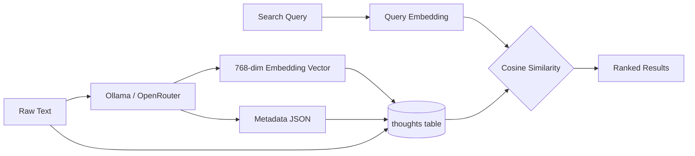

# Open Brain - Database Schema

> PostgreSQL + pgvector schema, functions, indexes, and security policies.

---

## How the Database Works

Open Brain stores every thought as a single row in one table. Each thought has:
- The **raw text** you captured
- A **vector embedding** (a list of 768 numbers) that represents the *meaning* of the text
- **Auto-extracted metadata** (type, topics, people, action items) as structured JSON
- Optional **project** and **created_by** fields for scoping

When you search, PostgreSQL compares your query's embedding vector against every stored vector using cosine similarity — finding thoughts by *meaning*, not keywords.



---

## Prerequisites

- **Supabase project** (free tier works) or self-hosted PostgreSQL 17
- **pgvector extension** enabled

---

## 1. Enable pgvector Extension

Run in Supabase SQL Editor:

```sql
-- Enable the vector extension for embedding storage and similarity search
CREATE EXTENSION IF NOT EXISTS vector;
```

---

## 2. Core Table: `thoughts`

> **Embedding dimensions:** The table below uses `VECTOR(768)` for the self-hosted Ollama deployment. If using Supabase + OpenRouter, change to `VECTOR(1536)`.

```sql
CREATE TABLE thoughts (
    id         UUID        DEFAULT gen_random_uuid() PRIMARY KEY,
    content    TEXT        NOT NULL,
    embedding  VECTOR(768),
    metadata   JSONB       DEFAULT '{}'::jsonb,
    project    TEXT,
    created_by TEXT,
    archived   BOOLEAN     DEFAULT false,
    supersedes UUID        REFERENCES thoughts(id),
    created_at TIMESTAMPTZ DEFAULT now(),
    updated_at TIMESTAMPTZ DEFAULT now()
);

-- Auto-update the updated_at timestamp on modifications
CREATE OR REPLACE FUNCTION update_updated_at_column()
RETURNS TRIGGER AS $$
BEGIN
    NEW.updated_at = now();
    RETURN NEW;
END;
$$ LANGUAGE plpgsql;

CREATE TRIGGER set_updated_at
    BEFORE UPDATE ON thoughts
    FOR EACH ROW
    EXECUTE FUNCTION update_updated_at_column();
```

### Column Details

| Column | Type | Purpose |
|---|---|---|
| `id` | UUID | Primary key, auto-generated |
| `content` | TEXT | Raw thought text (the actual note/idea/decision) |
| `embedding` | VECTOR(768) | 768-dimensional vector from nomic-embed-text (Ollama). Use 1536 for OpenRouter. |
| `metadata` | JSONB | Structured tags: type, topics, people, action_items, dates, source |
| `project` | TEXT | Optional project scope (NULL = unscoped) |
| `created_by` | TEXT | Optional user identifier for multi-developer provenance (NULL = unset) |
| `archived` | BOOLEAN | Soft-archive flag (default: false) |
| `supersedes` | UUID | FK to a prior thought this one replaces |
| `created_at` | TIMESTAMPTZ | When the thought was captured |
| `updated_at` | TIMESTAMPTZ | Auto-updated on modifications |

### Metadata JSONB Structure

```jsonc
{
    // Thought classification
    "type": "observation" | "task" | "idea" | "reference" | "person_note" | "decision" | "meeting" | "architecture" | "pattern" | "postmortem" | "requirement" | "bug" | "convention",

    // 1-3 topic tags extracted from content
    "topics": ["api-design", "architecture", "performance"],

    // People mentioned or involved
    "people": ["Sarah", "Mike"],

    // Implied action items extracted from content
    "action_items": ["Follow up with Sarah about Q2 timeline"],

    // Dates mentioned, normalized to YYYY-MM-DD
    "dates": ["2026-03-15"],

    // Where this thought came from
    "source": "mcp" | "slack" | "migration" | "manual" | "obsidian" | "notion"
}
```

---

## 3. Indexes

```sql
-- HNSW index for fast approximate nearest-neighbor vector search (cosine similarity)
CREATE INDEX idx_thoughts_embedding
    ON thoughts
    USING hnsw (embedding vector_cosine_ops);

-- GIN index for fast JSONB metadata queries (filtering by type, topic, person)
CREATE INDEX idx_thoughts_metadata
    ON thoughts
    USING gin (metadata);

-- B-tree index for date-range queries and ordering
CREATE INDEX idx_thoughts_created_at
    ON thoughts (created_at DESC);
```

### Index Explanations

| Index | Type | Purpose |
|---|---|---|
| `idx_thoughts_embedding` | HNSW | Approximate nearest-neighbor search on vector embeddings. Uses cosine distance. Fast even at millions of rows. |
| `idx_thoughts_metadata` | GIN | Enables efficient `@>` containment queries on JSONB (e.g., filter by type, topic tag, person). |
| `idx_thoughts_created_at` | B-tree DESC | Optimizes `ORDER BY created_at DESC` and date-range `WHERE` clauses. |
| `idx_thoughts_created_by` | B-tree | Optimizes filtering by user for multi-developer teams. |

---

## 4. Core Function: `match_thoughts`

This RPC function performs semantic vector similarity search with project scoping, archive filtering, and user filtering:

> **Dimension note:** The self-hosted Docker/K8s deployment uses `VECTOR(768)` (Ollama nomic-embed-text). The Supabase/OpenRouter deployment uses `VECTOR(1536)` (text-embedding-3-small). Adjust the vector dimension to match your embedder.

```sql
CREATE OR REPLACE FUNCTION match_thoughts(
    query_embedding  VECTOR(768),
    match_threshold  FLOAT   DEFAULT 0.5,
    match_count      INT     DEFAULT 10,
    filter           JSONB   DEFAULT '{}'::jsonb,
    project_filter   TEXT    DEFAULT NULL,
    include_archived BOOLEAN DEFAULT false,
    user_filter      TEXT    DEFAULT NULL
)
RETURNS TABLE (
    id         UUID,
    content    TEXT,
    metadata   JSONB,
    similarity FLOAT,
    created_at TIMESTAMPTZ
)
LANGUAGE plpgsql
AS $$
BEGIN
    RETURN QUERY
    SELECT
        t.id,
        t.content,
        t.metadata,
        1 - (t.embedding <=> query_embedding) AS similarity,
        t.created_at
    FROM thoughts t
    WHERE
        1 - (t.embedding <=> query_embedding) >= match_threshold
        AND t.metadata @> filter
        AND (project_filter IS NULL OR t.project = project_filter)
        AND (include_archived OR t.archived = false)
        AND (user_filter IS NULL OR t.created_by = user_filter)
    ORDER BY t.embedding <=> query_embedding ASC
    LIMIT match_count;
END;
$$;
```

### How It Works

1. **`query_embedding`**: The vector of the search query (768-dim for Ollama, 1536-dim for OpenRouter)
2. **`<=>`**: pgvector's cosine distance operator (0 = identical, 2 = opposite)
3. **`1 - distance`**: Converts to similarity score (1.0 = perfect match, 0.0 = unrelated)
4. **`match_threshold`**: Minimum similarity to include (default 0.5 = moderately related)
5. **`filter`**: Optional JSONB containment filter applied before ranking
6. **`match_count`**: Maximum results returned (default 10)
7. **`project_filter`**: Scope search to a specific project (NULL = all projects)
8. **`include_archived`**: Whether to include archived thoughts (default: false)
9. **`user_filter`**: Filter to thoughts by a specific user (NULL = all users)

### Usage Examples

```sql
-- Basic semantic search
SELECT * FROM match_thoughts(
    '[0.1, -0.2, ...]'::vector(768),   -- query embedding
    0.5,                                 -- threshold
    10,                                  -- limit
    '{}'::jsonb                          -- no filter
);

-- Search only decisions in a specific project
SELECT * FROM match_thoughts(
    '[0.1, -0.2, ...]'::vector(768),
    0.5,
    10,
    '{"type": "decision"}'::jsonb,
    'my-project'                         -- project_filter
);

-- Search thoughts by a specific user
SELECT * FROM match_thoughts(
    '[0.1, -0.2, ...]'::vector(768),
    0.3,
    5,
    '{"people": ["Sarah"]}'::jsonb,
    NULL,                                -- all projects
    false,                               -- exclude archived
    'sarah'                              -- user_filter
);
```

---

## 5. Row Level Security (RLS)

```sql
-- Enable RLS on thoughts table
ALTER TABLE thoughts ENABLE ROW LEVEL SECURITY;

-- Service role has full access (used by edge functions)
-- Anon/authenticated roles have NO access
-- This is the default Supabase behavior when no policies grant access

-- If you need explicit policies:
CREATE POLICY "Service role full access"
    ON thoughts
    FOR ALL
    USING (auth.role() = 'service_role');
```

**Key Security Points:**
- Edge Functions use the `SUPABASE_SERVICE_ROLE_KEY` (auto-injected)
- Service role bypasses RLS by default in Supabase
- No anonymous or authenticated user access to `thoughts` table
- All access goes through Edge Functions, which handle auth via `MCP_ACCESS_KEY`

---

## 6. Useful Queries

### Count all thoughts
```sql
SELECT COUNT(*) FROM thoughts;
```

### Thoughts by type
```sql
SELECT
    metadata->>'type' AS thought_type,
    COUNT(*) AS count
FROM thoughts
GROUP BY metadata->>'type'
ORDER BY count DESC;
```

### Top topics
```sql
SELECT
    topic,
    COUNT(*) AS count
FROM thoughts,
     jsonb_array_elements_text(metadata->'topics') AS topic
GROUP BY topic
ORDER BY count DESC
LIMIT 10;
```

### Top people mentioned
```sql
SELECT
    person,
    COUNT(*) AS count
FROM thoughts,
     jsonb_array_elements_text(metadata->'people') AS person
GROUP BY person
ORDER BY count DESC
LIMIT 10;
```

### Thoughts from last 7 days
```sql
SELECT id, content, metadata, created_at
FROM thoughts
WHERE created_at >= now() - INTERVAL '7 days'
ORDER BY created_at DESC;
```

### Filter by type
```sql
SELECT id, content, metadata, created_at
FROM thoughts
WHERE metadata @> '{"type": "decision"}'::jsonb
ORDER BY created_at DESC;
```

---

## 7. User Provenance (created_by)

The `created_by` column provides lightweight multi-developer provenance tracking. It's fully optional — omit it and everything works as a single-user system.

```sql
-- Column already exists in the base schema:
-- created_by TEXT (nullable, no default)
-- Index: idx_thoughts_created_by B-tree

-- Filter by user in queries:
SELECT * FROM thoughts WHERE created_by = 'sarah' ORDER BY created_at DESC;

-- Use in match_thoughts() via the user_filter parameter:
SELECT * FROM match_thoughts(
    '[0.1, -0.2, ...]'::vector(768),
    0.5, 10, '{}'::jsonb,
    NULL,      -- project_filter (all projects)
    false,     -- include_archived
    'sarah'    -- user_filter
);
```

The `created_by` field is a free-text string — use whatever identifier makes sense for your team (name, email, GitHub handle, etc.). It's available on all capture, search, list, and stats operations in both the REST API and MCP tools.

> **Full multi-user isolation** (RLS-based, where users can only see their own thoughts) is a future enhancement. The current `created_by` is a provenance/filter field, not an auth boundary.

---

## Provenance helpers

Migration `003-add-provenance-helpers.sql` adds generated columns, partial indexes, and an RPC function for exact-source lookup and deduplication. This is **additive** to the existing `match_thoughts` vector search — it is intended for exact-source hash matching, not semantic recall.

### Generated columns

Two generated columns are derived from the `metadata.provenance` JSONB sub-object:

| Column | Expression | Purpose |
|---|---|---|
| `source_file_hash` | `metadata->'provenance'->>'contentHash'` | Content hash of the originating source file |
| `code_hash` | `metadata->'provenance'->>'codeHash'` | Hash of the specific code block or snippet |

Both columns are `TEXT GENERATED ALWAYS AS (...) STORED`, so they update automatically whenever `metadata` changes.

### Partial indexes

Only non-null rows are indexed to keep the indexes compact:

- `idx_thoughts_source_file_hash` — B-tree on `source_file_hash WHERE source_file_hash IS NOT NULL`
- `idx_thoughts_code_hash` — B-tree on `code_hash WHERE code_hash IS NOT NULL`

### RPC: `match_thoughts_by_source`

```sql
match_thoughts_by_source(
    source_hash      TEXT,
    max_count        INT     DEFAULT 25,
    project_filter   TEXT    DEFAULT NULL,
    include_archived BOOLEAN DEFAULT false
)
RETURNS TABLE (id, content, metadata, project, created_by, created_at)
```

Returns thoughts whose `source_file_hash` matches `source_hash`, ordered by `created_at DESC`. Use it for exact-source deduplication or to find all thoughts captured from the same file.

**Typical usage:**

```sql
select * from match_thoughts_by_source('sha256:abc...', 10, 'openbrain', false);
```

---

## 8. Content Chunking Strategy (For Long-Form Content)

For documents longer than ~500 words, vector quality degrades. Use chunking:

```sql
-- Optional: parent-child relationship for chunked content
ALTER TABLE thoughts ADD COLUMN parent_id UUID REFERENCES thoughts(id);
ALTER TABLE thoughts ADD COLUMN chunk_index INT DEFAULT 0;

-- Query: find all chunks of a parent thought
SELECT * FROM thoughts
WHERE parent_id = 'some-uuid'
ORDER BY chunk_index ASC;
```

**Chunking Rules:**
- One row = one retrievable idea (atomic)
- Break long content into meaningful sections
- Each chunk gets its own embedding
- Maintain `parent_id` for reassembly
- Use metadata to tag `source` and `chunk_index`

---

## 9. Maintenance

```sql
-- Reindex vectors (after bulk imports)
REINDEX INDEX idx_thoughts_embedding;

-- Vacuum for performance (Supabase does this automatically, but can be manual)
VACUUM ANALYZE thoughts;

-- Check table size
SELECT pg_size_pretty(pg_total_relation_size('thoughts'));
```
