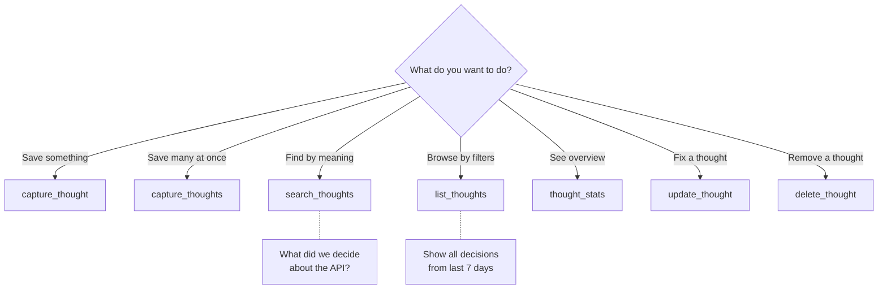

# Open Brain - MCP Server

> Model Context Protocol server implementation, tool definitions, and client configuration.

---

## What Is MCP?

**Model Context Protocol (MCP)** is Anthropic's open standard for connecting AI assistants to external tools and data sources. It enables any compatible AI client (VS Code Copilot, Claude, ChatGPT, Gemini, Cursor) to call tools exposed by an MCP server over HTTP.

Open Brain's MCP server exposes seven tools for reading, writing, updating, and deleting thoughts in your memory database.

---

## Server Architecture

```
AI Client (Copilot, Claude, ChatGPT, etc.)
    ↓ HTTP POST (MCP protocol)
    ↓ Auth: x-brain-key header or ?key= param
    ↓
Edge Function: open-brain-mcp
    ├─ Hono web framework (routing)
    ├─ MCP protocol handler (tool dispatch)
    ├─ OpenRouter client (embeddings)
    └─ Supabase client (database)
    ↓
PostgreSQL + pgvector
```

### Technology Stack

| Component | Technology | Why |
|---|---|---|
| Runtime | Deno (Supabase Edge Functions) | Serverless, no infra to manage |
| Framework | Hono | Lightweight, fast, Deno-native |
| Protocol | MCP (HTTP+SSE transport) | Universal AI client compatibility |
| Database | Supabase JS Client | Auto-injected credentials |
| Embeddings | OpenRouter API | Model-agnostic gateway |

---

## Tool Definitions

Open Brain exposes 7 tools. Here's when to use each one:



| Tool | Use When | Example Prompt |
|------|----------|---------------|
| `search_thoughts` | You have a *question* and want semantically related thoughts | *"What do I know about caching strategies?"* |
| `list_thoughts` | You want to *browse* thoughts by type, topic, person, or date | *"Show all decisions from the last 30 days"* |
| `capture_thought` | You want to save a single thought | *"Remember this: We chose Redis for caching"* |
| `capture_thoughts` | You want to save multiple thoughts at once | *"Save these 4 lessons from the postmortem"* |
| `thought_stats` | You want a high-level overview of your brain | *"How many thoughts do I have? What topics?"* |
| `update_thought` | A thought's content has changed | *"Update thought X with the new decision"* |
| `delete_thought` | A thought is wrong or no longer relevant | *"Delete thought X"* |

> **search vs list**: Use `search_thoughts` when you're looking for something specific by meaning (like a search engine). Use `list_thoughts` when you want to browse/filter (like a file manager).

### Tool 1: `search_thoughts`

**Purpose**: Semantic vector search — find thoughts by meaning, not exact keywords. Supports project scoping and metadata filters.

```json
{
    "name": "search_thoughts",
    "description": "Search your brain for thoughts semantically related to a query. Returns results ranked by similarity.",
    "inputSchema": {
        "type": "object",
        "properties": {
            "query": { "type": "string", "description": "Natural language search query" },
            "limit": { "type": "integer", "description": "Maximum results (default: 10)", "default": 10 },
            "threshold": { "type": "number", "description": "Minimum similarity 0-1 (default: 0.5)", "default": 0.5 },
            "project": { "type": "string", "description": "Scope to a specific project" },
            "type": { "type": "string", "description": "Filter by thought type" },
            "topic": { "type": "string", "description": "Filter by topic tag" },
            "include_archived": { "type": "boolean", "description": "Include archived thoughts (default: false)" },
            "created_by": { "type": "string", "description": "Filter to thoughts by a specific user" }
        },
        "required": ["query"]
    }
}
```

---

### Tool 2: `list_thoughts`

**Purpose**: Filtered listing — browse thoughts by type, topic, person, project, or date range.

```json
{
    "name": "list_thoughts",
    "inputSchema": {
        "type": "object",
        "properties": {
            "type": { "type": "string", "description": "Filter by type: observation, task, idea, reference, person_note, decision, meeting, architecture, pattern, postmortem, requirement, bug, convention" },
            "topic": { "type": "string", "description": "Filter by topic tag" },
            "person": { "type": "string", "description": "Filter by person mentioned" },
            "days": { "type": "integer", "description": "Only thoughts from the last N days" },
            "project": { "type": "string", "description": "Scope to a specific project" },
            "include_archived": { "type": "boolean", "description": "Include archived thoughts (default: false)" },
            "created_by": { "type": "string", "description": "Filter to thoughts by a specific user" }
        }
    }
}
```

---

### Tool 3: `capture_thought`

**Purpose**: Store a new thought with auto-generated embedding and metadata. Supports project scoping and provenance.

```json
{
    "name": "capture_thought",
    "inputSchema": {
        "type": "object",
        "properties": {
            "content": { "type": "string", "description": "The thought to capture (raw text)" },
            "project": { "type": "string", "description": "Scope to a project/workspace" },
            "source": { "type": "string", "description": "Provenance tracking (default: 'mcp')" },
            "supersedes": { "type": "string", "description": "UUID of a prior thought this replaces" },
            "created_by": { "type": "string", "description": "User who created this thought (optional, for multi-developer teams)" }
        },
        "required": ["content"]
    }
}
```

**Example Call:**
```json
{
    "tool": "capture_thought",
    "arguments": {
        "content": "Decision: Using PostgreSQL with pgvector instead of Pinecone.",
        "project": "openbrain",
        "source": "plan-forge-phase-1",
        "created_by": "sarah"
    }
}
```

---

### Tool 4: `thought_stats`

**Purpose**: Aggregate statistics about your brain's contents. Optionally scoped to a project or user.

```json
{
    "name": "thought_stats",
    "inputSchema": {
        "type": "object",
        "properties": {
            "project": { "type": "string", "description": "Scope stats to a specific project" },
            "created_by": { "type": "string", "description": "Scope stats to a specific user" }
        }
    }
}
```

---

### Tool 5: `update_thought`

**Purpose**: Update an existing thought. Re-generates embedding and re-extracts metadata automatically.

```json
{
    "name": "update_thought",
    "inputSchema": {
        "type": "object",
        "properties": {
            "id": { "type": "string", "description": "UUID of the thought to update" },
            "content": { "type": "string", "description": "New content for the thought" }
        },
        "required": ["id", "content"]
    }
}
```

**Example Call:**
```json
{
    "tool": "update_thought",
    "arguments": {
        "id": "a1b2c3d4-...",
        "content": "Updated: We switched from Redis to Memcached for the session cache."
    }
}
```

---

### Tool 6: `delete_thought`

**Purpose**: Permanently delete a thought by ID.

```json
{
    "name": "delete_thought",
    "inputSchema": {
        "type": "object",
        "properties": {
            "id": { "type": "string", "description": "UUID of the thought to delete" }
        },
        "required": ["id"]
    }
}
```

---

### Tool 7: `capture_thoughts` (batch)

**Purpose**: Batch capture multiple thoughts in one call. Each thought gets independent embedding + metadata extraction.

```json
{
    "name": "capture_thoughts",
    "inputSchema": {
        "type": "object",
        "properties": {
            "thoughts": {
                "type": "array",
                "items": { "type": "object", "properties": { "content": { "type": "string" } }, "required": ["content"] }
            },
            "project": { "type": "string", "description": "Scope all thoughts to a project" },
            "source": { "type": "string", "description": "Provenance (default: 'mcp')" },
            "created_by": { "type": "string", "description": "User who created these thoughts (optional)" }
        },
        "required": ["thoughts"]
    }
}
```

**Example Call:**
```json
{
    "tool": "capture_thoughts",
    "arguments": {
        "thoughts": [
            { "content": "Lesson: Always add DB indexes before load testing." },
            { "content": "Decision: Rate limit MCP endpoints to 100 req/min." }
        ],
        "project": "openbrain",
        "source": "phase-3-postmortem",
        "created_by": "mike"
    }
}
```

---

## Source/Provenance Lookup

Source-hash retrieval is exposed via the **REST API** (`GET /memories/by-source`) and the **database RPC** `match_thoughts_by_source`, not via a dedicated MCP tool. This keeps the MCP tool count at 7 while still providing exact-source deduplication for scripts, CI pipelines, and direct database consumers. See [02-DATABASE-SCHEMA.md — Provenance helpers](02-DATABASE-SCHEMA.md#provenance-helpers) for the full schema details.

---

## Client Configuration

### Self-Hosted (K8s + Tailscale)

These configs connect to your self-hosted Open Brain running on your K8s cluster.

### URL Reference

| Network | Protocol | URL |
|---|---|---|
| On tailnet | HTTP | `http://openbrain.tailfb4202.ts.net:8080/sse?key=<KEY>` |
| Off tailnet (Funnel) | HTTPS | `https://openbrain.tailfb4202.ts.net/sse?key=<KEY>` |
| LAN only | HTTP | `http://192.168.68.120:8080/sse?key=<KEY>` |

#### Claude Desktop (any network — via Tailscale Funnel)

Claude Desktop does **not** support SSE transport directly. Use `mcp-remote` as a stdio-to-SSE bridge.

Add to `claude_desktop_config.json`:

**Off tailnet (Funnel — public HTTPS):**
```json
{
    "mcpServers": {
        "openbrain": {
            "command": "npx",
            "args": ["-y", "mcp-remote", "https://openbrain.tailfb4202.ts.net/sse?key=<MCP_ACCESS_KEY>"]
        }
    }
}
```

**On tailnet (private):**
```json
{
    "mcpServers": {
        "openbrain": {
            "command": "npx",
            "args": ["-y", "mcp-remote", "http://openbrain.tailfb4202.ts.net:8080/sse?key=<MCP_ACCESS_KEY>"]
        }
    }
}
```

> **Requires**: Node.js installed. `mcp-remote` is fetched automatically by `npx`.

#### Claude Code / VS Code Copilot

Add to `~/.claude/settings.json`:

**On tailnet:**
```json
{
    "mcpServers": {
        "openbrain": {
            "type": "sse",
            "url": "http://openbrain.tailfb4202.ts.net:8080/sse?key=<MCP_ACCESS_KEY>"
        }
    }
}
```

**Off tailnet (Funnel):**
```json
{
    "mcpServers": {
        "openbrain": {
            "type": "sse",
            "url": "https://openbrain.tailfb4202.ts.net/sse?key=<MCP_ACCESS_KEY>"
        }
    }
}
```

#### Cursor

Add to `.cursor/mcp.json`:

**On tailnet:**
```json
{
    "mcpServers": {
        "openbrain": {
            "url": "http://openbrain.tailfb4202.ts.net:8080/sse?key=<MCP_ACCESS_KEY>",
            "transport": "sse"
        }
    }
}
```

**Off tailnet (Funnel):**
```json
{
    "mcpServers": {
        "openbrain": {
            "url": "https://openbrain.tailfb4202.ts.net/sse?key=<MCP_ACCESS_KEY>",
            "transport": "sse"
        }
    }
}
```

#### ChatGPT

1. Enable **Developer Mode** in ChatGPT settings
2. Add MCP connector with URL (use Funnel URL — ChatGPT needs public access):
   ```
   https://openbrain.tailfb4202.ts.net/sse?key=<MCP_ACCESS_KEY>
   ```
3. Set authentication to **"none"** (key is in URL)
4. **Note**: ChatGPT disables its built-in memory when Developer Mode is active — Open Brain replaces this functionality

#### Gemini

1. Go to **Settings → Extensions → MCP Tools**
2. Add connector URL (use Funnel URL — Gemini needs public access):
   ```
   https://openbrain.tailfb4202.ts.net/sse?key=<MCP_ACCESS_KEY>
   ```
3. Transport: **SSE**
4. Authentication: **None** (key is in URL)

**Verify:** Ask Gemini: *"Use the thought_stats tool to show my brain statistics."*

#### Windsurf

Add to `~/.codeium/windsurf/mcp_config.json`:

**On tailnet:**
```json
{
  "mcpServers": {
    "openbrain": {
      "serverUrl": "http://openbrain.tailfb4202.ts.net:8080/sse?key=<MCP_ACCESS_KEY>"
    }
  }
}
```

**Off tailnet (Funnel):**
```json
{
  "mcpServers": {
    "openbrain": {
      "serverUrl": "https://openbrain.tailfb4202.ts.net/sse?key=<MCP_ACCESS_KEY>"
    }
  }
}
```

---

### Supabase Cloud (Original)

If using the Supabase-hosted version instead of self-hosted K8s:

#### Claude Desktop (Supabase)

```json
{
    "mcpServers": {
        "open-brain": {
            "command": "npx",
            "args": ["-y", "mcp-remote", "https://<your-ref>.supabase.co/functions/v1/open-brain-mcp/sse?key=<your-64-char-hex-key>"]
        }
    }
}
```

#### Claude Code (Supabase)

```json
{
    "mcpServers": {
        "open-brain": {
            "type": "sse",
            "url": "https://<your-ref>.supabase.co/functions/v1/open-brain-mcp/sse?key=<your-64-char-hex-key>"
        }
    }
}
```

---

## REST API Equivalent

Every MCP tool has a REST API counterpart on port 8000, documented in the [README — REST API](../README.md#rest-api) section. Use the REST API for integrations that don't support MCP (webhooks, scripts, non-MCP AI clients).

---

## Authentication Details

### MCP Access Key

- **Format**: 64-character hexadecimal string
- **Generation**: `openssl rand -hex 32`
- **Storage**: Supabase Edge Function secret (`MCP_ACCESS_KEY`)
- **Transmission**: `x-brain-key` header (preferred) OR `?key=` URL param (fallback)

### Auth Flow

```
1. Client connects to /sse with key (x-brain-key header or ?key= URL param)
2. Server validates key against MCP_ACCESS_KEY environment variable
3. 401 if invalid/missing → connection rejected
4. If valid → SSE session created, session ID issued
5. Subsequent /messages POSTs authenticated implicitly via session ID
   (no key required — having a valid sessionId proves prior authentication)
```

> **Note**: The `/messages` endpoint does NOT require the API key. This is intentional —
> `mcp-remote` and other SSE clients POST to `/messages?sessionId=xxx` without including
> the key. Authentication is enforced at connection time on `/sse`.

### Security Considerations

- URL parameter method exposes key in server logs and browser history — use header method when possible
- Rotate key periodically by updating the K8s secret and client configs
- Never commit the key to source control
- Each user/deployment should have a unique key

---

## Troubleshooting

### "Tool not found" in AI client
- Verify MCP server URL is correct
- Check that the server is running: `kubectl get pods -n openbrain`
- Test health: `curl https://openbrain.tailfb4202.ts.net/health`

### "No active session. Connect to /sse first."
- **Cause**: SSE connection and `/messages` POST are hitting different pods
- **Fix**: Enable session affinity on the ClusterIP service:
  ```bash
  kubectl patch svc openbrain-api -n openbrain \
    -p '{"spec":{"sessionAffinity":"ClientIP"}}'
  ```

### mcp-remote ServerError / OAuth errors
- **Cause**: The `/messages` endpoint is returning 401, triggering mcp-remote's OAuth flow
- **Fix**: Auth must only be enforced on `/sse`, not on `/messages`. The session ID on `/messages` already proves authentication. Check `src/index.ts`.

### Claude Desktop doesn't show Open Brain tools
- Verify config file: `%APPDATA%\Claude\claude_desktop_config.json`
- Must have `mcpServers.openbrain` entry — Claude Desktop may overwrite on launch
- Fully quit (system tray → Quit) and relaunch after config changes
- Check MCP logs: `%APPDATA%\Claude\logs\mcp-server-openbrain.log`

### ChatGPT doesn't auto-use Open Brain tools
- ChatGPT is less intuitive than Claude at picking MCP tools automatically
- Explicitly instruct: "Use the Open Brain search_thoughts tool to find..."
- Usually becomes automatic after 1-2 demonstrations

### Search returns no results
- Check thought count with `thought_stats` tool
- Under 20-30 entries = sparse data, not broken
- Lower the similarity threshold (try 0.3 instead of 0.5)
- Test with exact captured terminology

### Capture works but search fails
- Verify `vector` extension is enabled: `CREATE EXTENSION IF NOT EXISTS vector;`
- Check that embeddings are being generated (look for null embedding column values)
- Verify `match_thoughts()` function exists in database
- Verify Ollama embedding model is pulled: `kubectl exec -n <ns> deploy/ollama-gpu-bridge -- ollama list`
